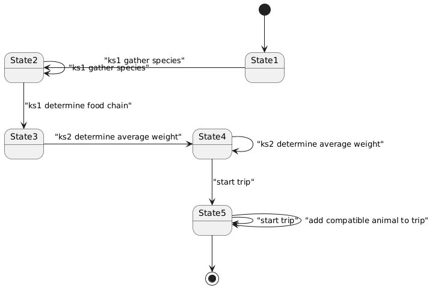

# Sample Blackboard

This is a prototype implementation of a blackboard architecture, running a sample blackboard
which is solving a specific problem. It is based on [rete-next](https://github.com/dsouflis/rete-next), 
another project of mine that implements a Rete engine. 
The knowledge base maintained by Rete serves as the *blackboard*, the shared data structure through 
which individual modules, the *knowledge sources*, collaborate.

Knowledge sources are heterogeneous, each providing a unique expertise to the problem. In the sample blackboard,
two of the knowledge sources consult ChatGPT, and two others implement regular code. The knowledge sources
are notified about changes to the blackboard by adding productions to the Rete engine which are fired by the
control shell of the blackboard. 

Two distinct components
constitute the *control shell* of the blackboard architecture. The *Scheduler* is responsible to select, out
of all eligible productions in the Rete engine, the allowed ones. The *Resolver* is responsible for doing
*conflict resolution* among the allowed productions. The blackboard performs cycles, honoring the scheduling
among knowledge sources that is dictated by the Scheduler and the Resolver, until there are no allowed
productions. The run is considered successful when the Scheduler considers the state of the problem-solving
process to be in a final state.

The above components will be detailed during the description of a concrete run of the sample blackboard.

## How to run

In order for the OpenAI API to be instantiated, one needs a `.env` file with the OpenAI key, like this:

```
OPENAI_API_KEY=xxxxxxxxxxxxxxxxxxxxxxxxxx
```

## The problem

We have a set of cages with animals of different species and genders at a river bank. We want to transfer 
them to the other side of the river. The boat has a single cage where a number of animals can fit, if their total 
weight is below some threshold, and if no animal eats any other. The manifest does not contain each animal's weight, 
so we have to determine the average weight of an individual of each species. We want to make as few trips as possible, 
so, we group animals together unless it is not feasible because one is a danger to some other one.

## The knowledge sources

Knowledge sources are defined with two things:
- a set of productions (written in the ['Productions0' grammar of 'rete-next'](https://github.com/dsouflis/rete-next/blob/main/productions0.ohm))
- the code (logic) that implements the firing of the corresponding productions

Each production logic is given the set of tokens (NB. in the Rete sense) that can be added, and those that can be
removed, and can decide on its own if it will handle all or some of them.

### Knowledge Source 1
KS 1 is responsible for retrieving the information about which species in our set eats which other. We need this
information because we want to transfer animals of different species together with safety. 
It defines the following productions:

```
((<x> species <s>) -{(species <s> -)} -> "ks1 gather species")
((species <s> -) -> "ks1 determine food chain")
```

As you'll see, the former production is fired for individual tokens, while the latter consumes
all tokens at once.

### Knowledge Source 2

Knowledge Source 2 is responsible for determining the average weight of each species. It does so by querying
ChatGPT.

```
((species <s> -) -> "ks2 determine average weight")
```
The production is fired for individual tokens.

### Knowledge Source 3

Knowledge Source 3 is responsible for arranging trips, while honoring the constraints described in the problem.

```
((animal <a> -) -{(<t> includes <a>)} -> "start trip")
(
 (trip <t> -) 
 (<wt> <- #sum(<w>)) from {(<t> includes <aa>) (<aa> species <ss>) (<ss> weight <w>)}
 (animal <b> -) 
 -{(trip <t2> -) (<t2> includes <b>)} 
 (<b> species <s2>) 
 -{(<t> includes <aa>) (<aa> species <ss>) (<s2> eats <ss>)} 
 -{(<t> includes <aa>) (<aa> species <ss>) (<ss> eats <s2>)} 
 (<s2> weight <w2>)
 ((<w2> + <wt>) < 100)
 -> "add compatible animal to trip"
)
```

The logics of this knowledge source do not invoke any external API. 

The second production is a bit convoluted, because it must implement a complex query.
The syntax for negation is exactly like that
used in [Robert B. Doorenbos' PhD Thesis: Production Matching for Large Learning Systems](http://reports-archive.adm.cs.cmu.edu/anon/1995/CMU-CS-95-113.pdf)
but the syntax for aggregates is my own, so here's a breakdown so that you can follow along:

```
 (<wt> <- #sum(<w>)) from {(<t> includes <aa>) (<aa> species <ss>) (<ss> weight <w>)}
```

means that variable `<wt>` is given the value of the sum of `<w>` from all sets of:
the trip `<t>` (the one we are working on) including animal `<aa>`, which is of species `<ss>`
which has an average weight of `<w>`.

## The Scheduler

The scheduler in this prototype architecture, defines the sequences of allowed productions using a 
regular grammar. The regular expression for the sample problem is the following:

```
# define symbols
a1   = 0; # First production of KS 1
a2   = 1; # Second production of KS 1
a3   = 2; # First production of KS 2
a4   = 3; # First production of KS 3
a5   = 4; # Second production of KS 3

# define main state machine pattern
main = a1+ a2 a3+ (a4 a5*)+;
```

Let me explain what it means in the context of how knowledge sources will be scheduled among themselves. 

- Production "ks1 gather species" must be fired one or more times.
- Then, production "ks1 determine food chain" must be fired once.
- Then, production "ks2 determine average weight" must be fired one or more times.
- Then, a number of one or more times of the following sequence will happen:
  - Production "start trip" will be fired once
  - Then, production "add compatible animal to trip" may be fired zero or more times

The following DFA (deterministic finite automaton), which is the translation of the regex above,
is constructed internally and is followed during the execution of the blackboard. It will help you later,
when we go through the trace of a run.



## The Resolver

The resolver used in this problem is an `OverridingSelfTransitionResolver`, which is configured to give
precedence to specific productions, and otherwise delegates to `SelfTransitionResolver`, which prioritizes
self-transitions. This is done so that regex phrases like `x* y` first consume as many x's as possible before
consuming y. The resolver, when a self-transition is not available, delegates to `TrivialResolver` which
returns a random production among the available ones.

## Trace of a run

Let us now watch all components, described above, work together to solve this problem.

The input data are the following:

```
(animal a1 -) (a1 species rabbit) (a1 gender male) 
(animal a2 -) (a2 species rabbit) (a2 gender female) 
(animal a3 -) (a3 species wolf) (a3 gender female) 
(animal a4 -) (a4 species snake) (a4 gender male)
```

The 'rete-next' engine uses triples, so three kinds of triples are used to encode identity, species and gender.

The current state of the Scheduler is "State1" (see image). Initially the trace shows:

```
Transitions can fire: "ks1 gather species"
Production "ks1 gather species" can add: 4
Added species: rabbit
Transitioned to state 2
```

Firing the transition adds `(species rabbit -)`. Current state is now "State2". Next, the trace shows:

```
Self-transition "ks1 gather species" can fire
Production "ks1 gather species" can add: 2
Added species: wolf
Transitioned to state 2
```

Notice that we removed one token of the four, but there are now only two remaining. This is because, when
we added `(species rabbit -)`, one of the three was removed because its negative condition was not 
satisfied anymore. Remember that the production has the following conditions:
`(<x> species <s>) -{(species <s> -)}`. The trace shows one more execution of this production:

```
Self-transition "ks1 gather species" can fire
Production "ks1 gather species" can add: 1
Added species: snake
Transitioned to state 2
```

There are no more eligible tokens to fire production "ks1 gather species" for. So the trace reveals that
we move to the next step of the scheduling regex:

```
Production "ks1 determine food chain" can add: 3
((species rabbit -)) ((species wolf -)) ((species snake -))
rabbit
wolf
snake
Retrieving food chain for: rabbit,wolf,snake
Added: rabbit eats grass
Added: wolf eats rabbit
Added: snake eats rabbit
Transitioned to state 3
```

This production uses the following 'assistant' directive.

> Given a list of species, respond with lines of knowledge triples in the
> form of 'species,eats,species' on each line. Exclude triples that use species
> not provided in the list. Avoid stopwords and any other text than the list of triples.
 
It ends up adding the following triples: `(rabbit eats grass) (wolf eats rabbit) (snake eats rabbit)`.

We are now on "State3", and we fire "ks2 determine average weight" three consecutive times, transitioning
to "State4" after the first time.

```
Transitions can fire: "ks2 determine average weight"
Production "ks2 determine average weight" can add: 3
Retrieving average weight for: rabbit
Added: rabbit weight 2
Transitioned to state 4
Transitions can fire: "ks2 determine average weight","start trip"
Production "ks2 determine average weight" can add: 2
Retrieving average weight for: wolf
Added: wolf weight 40
Transitioned to state 4
Transitions can fire: "ks2 determine average weight","start trip"
Production "ks2 determine average weight" can add: 1
Retrieving average weight for: snake
Added: snake weight 1.5
Transitioned to state 4
```

This knowledge source uses the following 'assistant' directive with ChatGPT:

> Given a species, respond with the average weight of an individual of the species in kilograms.
> Respond with just a number, without other words or punctuation.

These facts are added during these steps (notice that exact numbers may vary from run to run): 
`(rabbit weight 2) (wolf weight 40) (snake weight 1.5)`.

We are now in the trickiest part of the scheduling regex, so I will ask your attention.
At first, only production "start trip" is eligible.

```
Transitions can fire: "start trip"
Production "start trip" can add: 4
Added trip gensym0 with a1
Transitioned to state 5
```

We are now on "State5" having added `(trip gensym0 -) (gensym0 includes a1)`. The next step is 
the following.

```
Transitioned to state 5
Transitions can fire: "start trip","add compatible animal to trip"
Production "add compatible animal to trip" can add: 1
To trip gensym0 we added a2
Transitioned to state 5
```

Both productions are self-transitions, so ordinarily "start trip" would be selected. But the 
resolver we use gives precedence to "add compatible animal to trip". The reason is that we want
to try and add as many other animals to the same trip as possible (given weight constraints and
information about which species eats which), before starting another trip with one of the remaining
animals. This was done by using the following configuration for the resolver:

```typescript
  let resolver = new OverridingSelfTransitionResolver([4]);
```

If you refer to the regex definition, `4` is the "add compatible animal to trip" production.

So now the first trip looks like `(trip gensym0 -) (gensym0 includes a1) (gensym0 includes a2)`.

But now we can find no compatible animal. So next we see:

```
Transitions can fire: "start trip"
Production "start trip" can add: 2
Added trip gensym1 with a3
Transitioned to state 5
```

The new trip is `(trip gensym1 -) (gensym1 includes a3)` (the wolf).
And now we have a choice of starting a new trip, or adding the remaining animal to a trip.
For the same reasons I explained above, the latter is selected by the resolver.

```
Transitions can fire: "start trip","add compatible animal to trip"
Production "add compatible animal to trip" can add: 1
To trip gensym1 we added a4
Transitioned to state 5
No allowed transitions can fire
No further transitions, reached accepting state
```

The final state of the blackboard (the Rete working memory) is:

```
(animal a1 -) (a1 species rabbit) (a1 gender male) 
(animal a2 -) (a2 species rabbit) (a2 gender female) 
(animal a3 -) (a3 species wolf) (a3 gender female) 
(animal a4 -) (a4 species snake) (a4 gender male)
(species rabbit -) (species wolf -) (species snake -) 
(rabbit eats grass) (wolf eats rabbit) (snake eats rabbit) 
(rabbit weight 2) (wolf weight 40) (snake weight 1.5) 
(trip gensym0 -) (gensym0 includes a1) (gensym0 includes a2) 
(trip gensym1 -) (gensym1 includes a3) (gensym1 includes a4)
```

NB. It has happened that a run creates three trips, when the food chain also happens to contain `(wolf eats snake)`!
Please remember that ChatGPT responses are not deterministic.

## Conclusion

That was a demonstration of how a blackboard architecture can be implemented on top of a Rete engine, and 
also how the blackboard can serve as infrastructure to coordinate custom logic and external LLMs, without
hardcoded data pipelines and without coupling them. Although it does not specifically target the domain of
applications powered by LLMs, like LangChain does, it can be used to create applications that coordinate 
different LLM invocations and components around them, and LangChain can be used to create knowledge sources
around LLMs that leverage all the very useful functionalities it offers for pre- and post-processing. The main
idea is that of using the blackboard (a [tuple space](https://en.wikipedia.org/wiki/Tuple_space), minus
concurrency, plus more advanced triggering mechanisms) as the lingua franca for different components to 
interoperate, and to orchestrate their interactions using the blackboard control shell.
